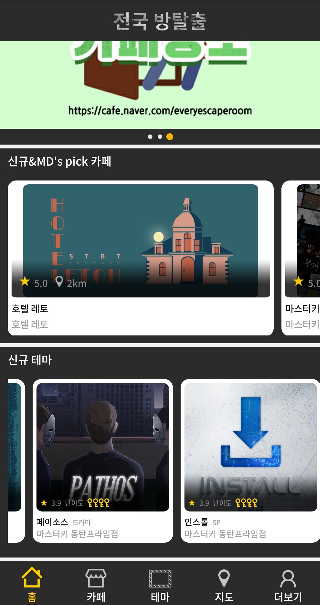

# App server study code 

```
애플리케이션 rest api설계 및 api sheet작성 
```

### 공부 용도로 사용했었던 클론앱 '전국방탈출' 백엔드 코드를 저장하기 위한 저장소 입니다.


---
## 개발 환경


---

## Server Clone App : 전국 방탈출


--- 

## ERD 설계도

>URL : https://aquerytool.com:443/aquerymain/index/?rurl=060c74a3-44ee-48d7-a465-d50ce7ea22db&

>Password : v7g731

---
## API Sheet

>https://docs.google.com/spreadsheets/d/1Zw9Q9GtI5gqAeZHfsJmILvcVwINKMHejNJ7pWRJeDVY/edit?usp=sharing

---
## License
#### 본 템플릿은 소프트스퀘어드에 소유권이 있으며 본 자료에 대한 상업적 이용 및 무단 복제,배포 및 변경을 원칙적으로 금지하며 이를 위반할 때에는 형사처벌을 받을 수 있습니다.

